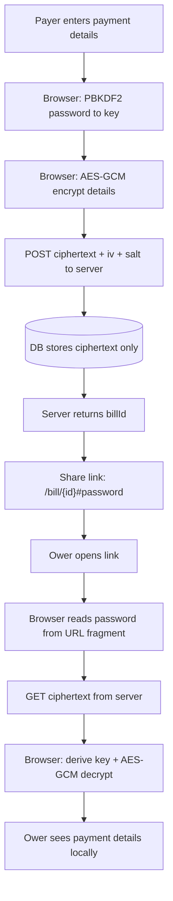

# Bill Splitter — Implementation Plan

> A no-signup, easy-to-use bill splitter. Payer scans/enters a bill, adds their payment details (encrypted zero-knowledge), and shares a password-protected link. Owers open the link, claim their items, and get a summary of what they owe.

## Context

Goal: let one person (the **payer**) close out a shared bill without anyone needing an account. Owers receive a link, unlock it with a password, claim the items they consumed, and see how much to pay the payer — including the payer's payment details (PayPal / IBAN), which must **never** be readable by the server or leaked from the database.

## Core Design Decisions

| Decision | Choice | Why |
|---|---|---|
| Split model | **Claim items** | Owers check off what they consumed; shared items split among claimers. Fits restaurant/grocery receipts. |
| Encryption | **Client-side (zero-knowledge)** | Password never reaches the server. Server only ever stores/serves ciphertext. |
| OCR | **LLM vision** | Send receipt photo to a vision model → structured line-item JSON. Robust on messy receipts. |
| No sign-up | **Anonymous, link-based** | Bill identified by a random ID; access gated by password held in the URL fragment. |

## The Encryption Model (most important part)

**Only the payment details are encrypted.** Bill items, prices, and names are stored in plaintext (they need to be shown to any ower who has the link). The sensitive data is the payer's PayPal address / IBAN.

### Key derivation
- Payer's browser generates (or the payer types) a **password**.
- Derive an AES key from the password using **PBKDF2** (or Argon2id) with a random salt: `key = PBKDF2(password, salt, iterations)`.
- Encrypt payment details with **AES-GCM**: `ciphertext = AES-GCM(key, iv, paymentDetailsJSON)`.
- Server stores: `{ ciphertext, iv, salt, iterations }`. **Never** the password or the key.

### Where the password lives
The password is placed in the **URL fragment** of the share link:

```
https://app.example.com/bill/{billId}#{password}
```

- The `#fragment` is **never sent to the server** by browsers — it stays client-side.
- The ower's browser reads `location.hash`, derives the key, fetches the ciphertext, and decrypts locally.
- The server literally cannot decrypt the payment details, even if the DB leaks.

> ⚠️ Trade-off: anyone with the full link can decrypt. That's acceptable and expected — the link *is* the credential. Optionally support a separate password (link without `#`, password sent via another channel) for higher security; make this a toggle.

### Flow diagram



## Personas & User Flows

### Payer flow
1. Land on home page → "Create a bill" (no sign-up).
2. **Scan** a receipt photo *or* **manually add** items.
   - Scan: upload/capture image → LLM vision → editable list of `{ name, price, qty }`.
3. **Review & fix**: edit any line item, add/remove items, set tax/tip/total.
4. **Add payment details**: PayPal address and/or IBAN.
5. Browser **encrypts** payment details (see model above), sets/generates password.
6. Browser POSTs `{ items, totals, encryptedPayment }` → server returns `billId`.
7. App shows the **share link** (`/bill/{id}#{password}`) with copy button.

### Ower flow
1. Open share link → app reads password from URL fragment.
2. If password is in fragment, auto-unlock; else prompt for password.
3. **Set name** (just a display name, no account).
4. See the **item list** → **claim items** (checkboxes; shared items can be claimed by multiple people and split).
5. Submit → see **summary**: subtotal of claimed items + proportional tax/tip = **amount to pay**, shown alongside decrypted payment details (PayPal/IBAN).

## Data Model

```mermaid
bills
  id            uuid (public, in URL)
  items         jsonb   -- [{ id, name, price, qty }]  (plaintext)
  totals        jsonb   -- { subtotal, tax, tip, total }
  payment_enc   text    -- AES-GCM ciphertext (base64)
  payment_iv    text
  payment_salt  text
  kdf_iterations int
  created_at    timestamptz

claims
  id            uuid
  bill_id       uuid -> bills.id
  ower_name     text
  item_id       text    -- references items[].id
  share         float   -- fraction of item claimed (for splitting)
  created_at    timestamptz
```

- Split logic: an item claimed by N people → each owes `price / N` (or weighted by `share`).
- Tax/tip: allocate proportionally to each ower's claimed subtotal.

## Recommended Stack

- **Next.js (App Router)** — pages + API routes in one deploy.
- **Postgres** via **Supabase** or **Neon** — `jsonb` for items, easy hosting, no ORM lock-in.
- **Web Crypto API** (`crypto.subtle`) — native PBKDF2 + AES-GCM in the browser, no crypto library needed.
- **LLM vision** for OCR — receipt image → structured JSON via an API route (image never stored long-term; discard after parse).
- **Tailwind + shadcn/ui** — fast, clean, mobile-first (owers will mostly be on phones).
- Deploy on **Vercel**.

## Build Phases

### Phase 1 — Manual bill + core flow (no crypto, no OCR)
- Home page, create-bill form (manual items only).
- Store bill, generate `billId`, produce share link.
- Ower page: set name, claim items, see summary.
- **Goal:** prove the end-to-end split flow works.

### Phase 2 — Zero-knowledge payment details
- Web Crypto: PBKDF2 + AES-GCM encrypt/decrypt in browser.
- Password in URL fragment; auto-unlock on open.
- Store only ciphertext server-side.
- Show decrypted payment details on ower summary.

### Phase 3 — OCR scanning
- Image upload/capture → API route → LLM vision → line items.
- Editable review step before saving.

### Phase 4 — Polish
- Shared-item splitting UI, proportional tax/tip.
- Mobile refinements, copy-to-clipboard, QR code for share link.
- Optional: separate-password mode (link without fragment).

## Milestones

Detailed tasks live in [`milestones/`](./milestones/). Track status in [`MILESTONES.md`](./MILESTONES.md).

| # | Milestone | Phase | Status |
|---|-----------|-------|--------|
| 1 | Project bootstrap | 1 | `completed` |
| 2 | Database schema (`bills`, `claims`) | 1 | `completed` |
| 3 | Split calculation logic | 1 | `completed` |
| 4 | Bill & claims API | 1 | `completed` |
| 5 | Payer UI — manual bill | 1 | `completed` |
| 6 | Ower UI — claim & summary | 1 | `pending` |
| 7 | Client-side crypto (Web Crypto API) | 2 | `pending` |
| 8 | Encrypted payment flow (payer) | 2 | `pending` |
| 9 | Ower decrypt & payment summary | 2 | `pending` |
| 10 | Receipt scan (OCR) | 3 | `pending` |
| 11 | Shared-item & tax/tip polish | 4 | `pending` |
| 12 | Mobile UX & share tools (QR, copy) | 4 | `pending` |
| 13 | Payer edit token & bill lifecycle | 4 | `pending` |
| 14 | Deploy MVP | 4 | `pending` |

## Open Questions / Risks

- **Link = credential**: anyone with the full link can decrypt payment details. Document this clearly; consider the separate-password toggle for sensitive cases.
- **No auth on edits**: how does the payer re-edit a bill later? Option: give the payer a secret `editToken` (also in a fragment) that unlocks write access.
- **OCR accuracy**: always require a human review step — never trust extracted totals blindly.
- **Abuse/spam**: anonymous creation invites junk. Add rate limiting + bill expiry (e.g. auto-delete after 90 days).
- **GDPR**: payment details are personal data; zero-knowledge encryption + auto-expiry helps. Add a "delete this bill" action.

## References

- [Web Crypto API — SubtleCrypto](https://developer.mozilla.org/en-US/docs/Web/API/SubtleCrypto)
- [PBKDF2 key derivation](https://developer.mozilla.org/en-US/docs/Web/API/SubtleCrypto/deriveKey)
- [URL fragment is not sent to server (RFC 3986 §3.5)](https://datatracker.ietf.org/doc/html/rfc3986#section-3.5)

---

_Added: 2026-07-10_
